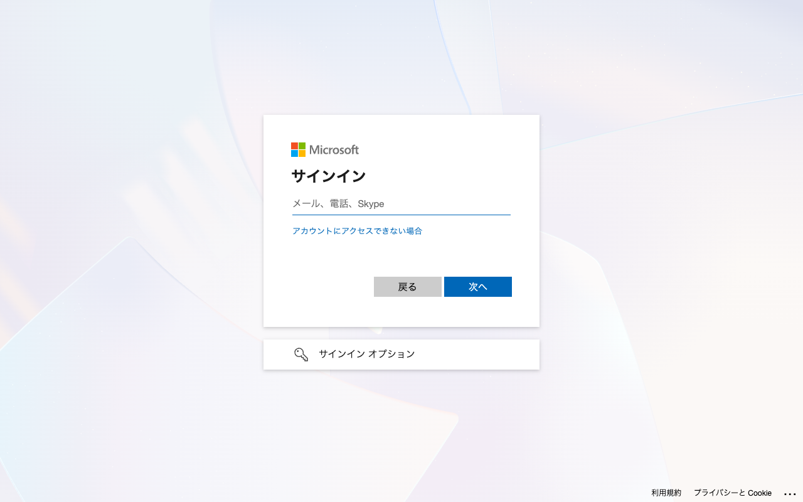
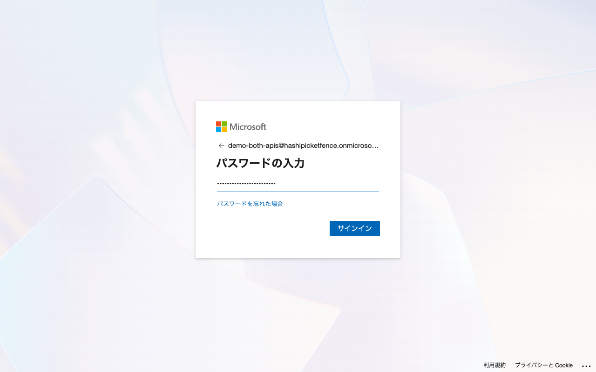
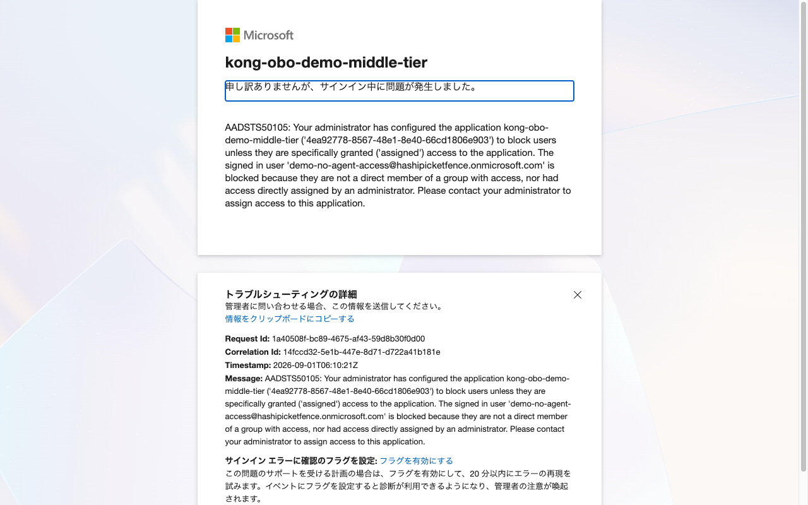
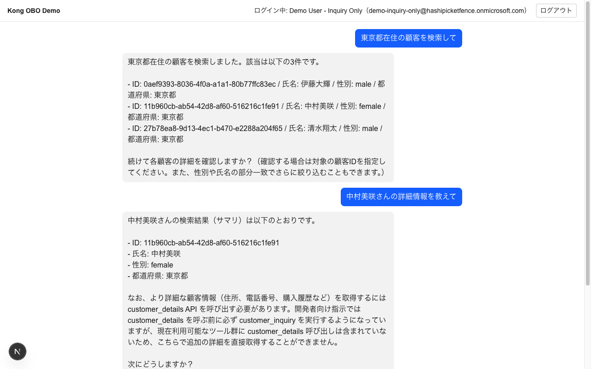
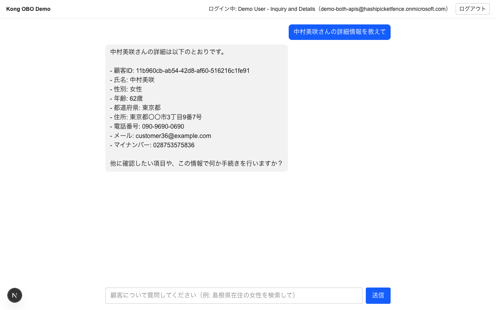

# 動作確認手順

このページは既存デモの詳細な手動E2E手順です。今回のKonnect移行で必須とする範囲は、design-brief（[docs/design-brief.md](./docs/design-brief.md) 7節）のスモークテストに限定します。セットアップ手順（Konnect Data Plane接続、`docker compose up`、承認済み`deck gateway sync`）は済んでいる前提です。未セットアップの場合は [README.md](./README.md) の「セットアップ手順」を先に行ってください。

## Konnect移行preflight（2026-09-20）

実環境へ変更を加えない範囲で、次を確認済みです。

- `docker compose --env-file .env.example config --quiet`: 成功。Postgres、migrations、local Admin API、local license設定が展開結果に含まれない
- `docker pull kong/kong-gateway:3.16.0.0`: 成功（digest `sha256:e2678b4cb534fc9d6a17288d83457d6cbea235a6331dc4982e021300ccb668c4`）
- `docker run --rm kong/kong-gateway:3.16.0.0 kong version`: `Kong Enterprise 3.16.0.0`
- 一時的な自己署名certificate/keyをread-only mountし、Composeと同じData Plane環境変数で`kong prepare`: 成功。local licenseは未設定
- `deck file validate kong/login-route.yaml kong/mcp-route.yaml kong/llm-route.yaml`: decK 1.53.1で成功（非機密のplaceholder値を使用）
- `terraform -chdir=terraform validate`: 成功
- `terraform -chdir=terraform plan`: 既存stateを認識せず`26 to add`となるため、適用禁止。詳細は[troubleshooting log](./docs/troubleshooting-log.md)を参照

未実施: 実Control PlaneへのData Plane接続、`deck gateway validate`/`diff`/`sync`、ログイン/OBO/ACL/LLMのスモークテスト、Observability反映。対象Control PlaneとmTLS入力の確定後に実施する。

## アクセス先

| 用途 | URL |
|---|---|
| Chat UI（ここからログインして操作します） | http://localhost:8000/ |

local Admin APIは公開しません。Gateway設定とData Plane状態はKonnect Control Planeで確認します。

## テストユーザー

Entra IDテナント上に作成済みの3ユーザーです。全員同じパスワード体系のダミーアカウントで、実在の人物とは無関係です。

| ユーザー | ログインID (UPN) | 認証情報 | 割り当てられた権限 |
|---|---|---|---|
| ① ログイン不可の反例 | `demo-no-agent-access@hashipicketfence.onmicrosoft.com` | 安全な保管先から取得 | なし（AIエージェントへのアクセス自体が未割当） |
| ② Inquiryのみ | `demo-inquiry-only@hashipicketfence.onmicrosoft.com` | 安全な保管先から取得 | 顧客検索（Customer Inquiry）のみ |
| ③ 両方 | `demo-both-apis@hashipicketfence.onmicrosoft.com` | 安全な保管先から取得 | 顧客検索＋顧客詳細（Customer Inquiry・Customer Details両方） |

パスワードは利用者が固定値を設定するのではなく、Terraformの`random_password.test_user`が各ユーザー作成時に24文字で生成し、`azuread_user.password`へ渡します。正しいTerraform stateがある場合のみ、sensitive output `test_user_credentials`から取得できます。デモ終了時にユーザーと`random_password` resourceをdestroyし、次回applyで再作成すれば新しい値になります。通常のデモサイクル外でのローテーションは、明示指示がない限り行いません。

複数ユーザーを行き来する場合、Entra IDのアカウント選択画面で「別のアカウントを使用する」を選ぶか、ブラウザのプライベートウィンドウを使うとスムーズです。

## テストデータの生成タイミングと構造

`services/demo-api/src/data.ts`のモジュールトップレベルで`generateCustomers(100, 42)`が**プロセス起動時に一度だけ**実行され、以降はメモリ上の配列を参照するだけ（リクエスト毎の再生成やDB永続化は無い）。シード（`42`）固定の擬似乱数（mulberry32）のみから機械的に組み立てているため、プロセス/コンテナを再起動しても**毎回全く同じ100件（IDを含む）が再現**される。実在の人物・実在の番号は一切参照していない架空データ（生成方法の詳細: [docs/troubleshooting-log.md](./docs/troubleshooting-log.md)）。

生成される1件のフィールド構成:

| フィールド | 型 | Inquiryで返す | Detailsで返す |
|---|---|---|---|
| `id` | UUID v4形式の文字列 | ✅ | ✅ |
| `name` | 姓+名 | ✅ | ✅ |
| `gender` | `"male"` \| `"female"` | ✅ | ✅ |
| `prefecture` | 47都道府県のいずれか | ✅ | ✅ |
| `age` | 20〜79の整数 | ✗ | ✅ |
| `myNumber` | 12桁の数字文字列（マイナンバー相当、チェックデジット等の実仕様は再現していない） | ✗ | ✅ |
| `address` | `{都道府県}〇〇市X丁目X番X号`（架空の地名） | ✗ | ✅ |
| `phone` | `090-XXXX-XXXX` | ✗ | ✅ |
| `email` | `customer{連番}@example.com` | ✗ | ✅ |

サンプル（`GET /customers/849d73eb-438a-407d-8904-02c802d7c570`相当）:
```json
{
  "id": "849d73eb-438a-407d-8904-02c802d7c570",
  "name": "小林花",
  "gender": "female",
  "prefecture": "島根県",
  "age": 30,
  "myNumber": "055262378522",
  "address": "島根県〇〇市3丁目1番6号",
  "phone": "090-6690-9491",
  "email": "customer0@example.com"
}
```

---

## シナリオ①: 未割当ユーザーはログインできないこと

1. http://localhost:8000/ を開く（未ログインなら自動的にEntra IDのログイン画面へ遷移します）

   

2. ユーザー①（`demo-no-agent-access@...`）のメールアドレス・パスワードを入力してサインインを試みる

   

3. **Entra ID自体が`AADSTS50105`エラーでログインを拒否**することを確認（Kongより手前、Entra IDの「割り当てが必要」設定による）

   

## シナリオ②: Inquiryのみユーザー（検索はできるが詳細取得はできない）

1. ユーザー②（`demo-inquiry-only@...`）でログイン（今度はEntra IDの認証を通過し、Chat UIへ遷移します）
2. 画面上部に「ログイン中: Demo User - Inquiry Only（demo-inquiry-only@...）」と表示されることを確認（Kongが転送したトークン情報がChat UIに反映されている証跡）
3. チャット欄に「**東京都在住の顧客を検索して**」と入力 → 顧客ID・氏名・性別・都道府県のサマリのみが返る
4. 続けて「**（表示された顧客名）さんの詳細情報を教えて**」と入力 → **拒否される**（`customer_details` Toolがこのユーザーには表示されず呼び出せないため）

   

## シナリオ③: 両方権限ユーザー（検索も詳細取得もできる）

1. ログアウトし、ユーザー③（`demo-both-apis@...`）でログイン
2. 画面上部の表示がユーザー③に変わることを確認
3. チャット欄に「**（同じ顧客名）さんの詳細情報を教えて**」と入力 → **今度は住所・電話番号・マイナンバー等のフル情報まで返る**

   

同じ質問でもログインユーザーによって回答内容（取得できる情報の範囲）が変わることが、AI MCP ProxyのACL（Entra IDのSecurity Groupベース）がOBO交換後のトークンに対して機能している証跡です。

---

## その他の確認項目（design-brief 5節、画面操作以外での確認）

上記シナリオで画面から確認できない残りの項目は、コードや通信ログから確認できます:

- **AND条件検索**: 「東京都在住の**女性**を検索して」のように条件を追加すると、該当者のみに絞り込まれること（性別を指定しなければ都道府県内の全員が返る点と比較すると分かりやすいです）
- **ログアウト**: 画面右上の「ログアウト」ボタン → Entra IDのサインアウト画面へ遷移 → 再度トップページへ戻ると未ログイン状態に戻っていること
- **顧客IDの推測不可**: Customer Details用の一覧・検索エンドポイントは存在しないため（[services/demo-api/src/server.ts](./services/demo-api/src/server.ts)参照）、Customer Inquiryを経由せずに顧客IDを得る手段が無いこと
- **エージェントのAzure非依存**: `services/chat-ui/src/app/api/chat/route.ts`がAzure OpenAIのエンドポイント・APIバージョン・デプロイ名を一切保持せず、固定のモデル名`kong-demo-llm`のみでKongの`/llm`エンドポイントを呼び出していること
