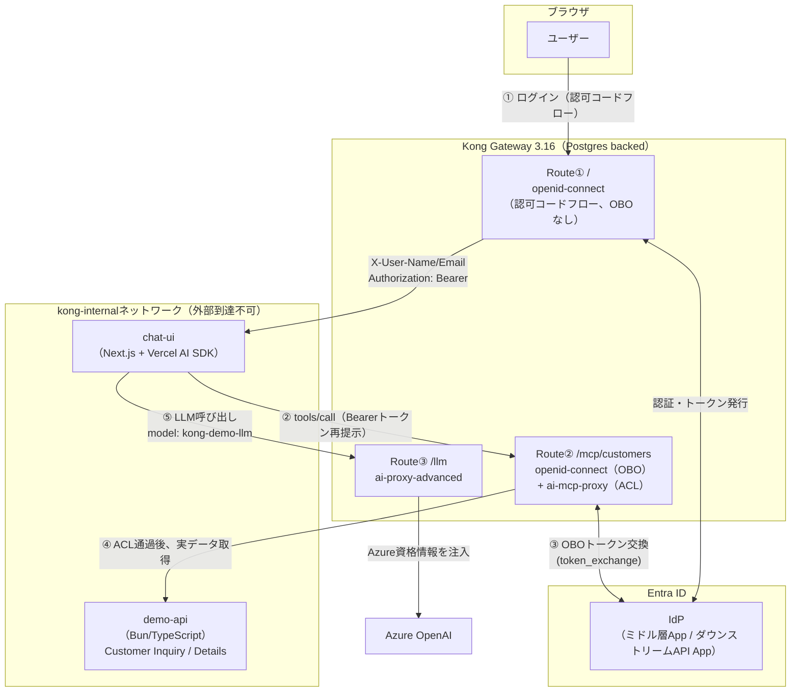
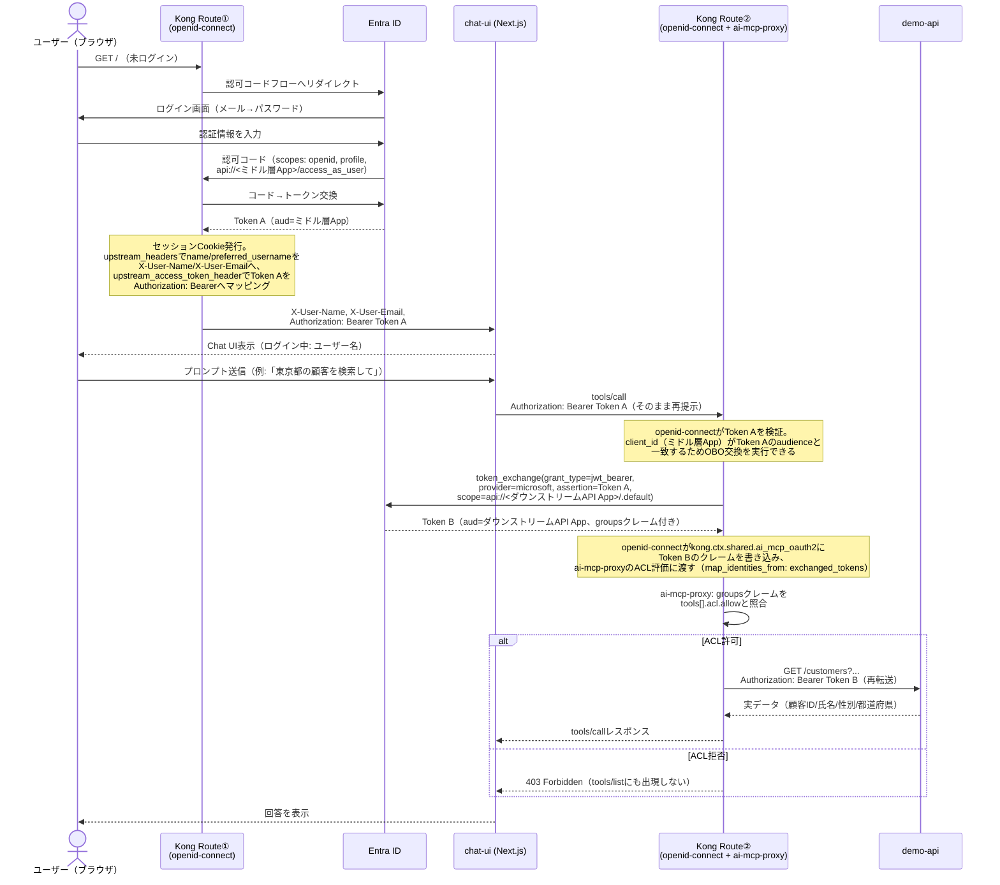

# OBO（On-Behalf-Of）解説

このデモにおける全体構成と、Kong Gateway と Entra ID の間で実際に行われている OBO（On-Behalf-Of）トークン交換の詳細をまとめます。設計判断の背景は [design-brief.md](./design-brief.md) を、実装時に判明した挙動は [troubleshooting-log.md](./troubleshooting-log.md) を参照してください。

## 1. 全体構成

Kong Gateway が単一のエントリポイント（`http://localhost:8000`）として、性質の異なる3系統の通信をフロントします。ブラウザ・Next.js・デモAPI・Azure OpenAI はいずれも Kong を介してのみ到達可能で、相互に直接通信しません（`kong-internal` ネットワーク、`internal: true`）。



- **Route①（`kong/login-route.yaml`）**: ブラウザ⇄Next.jsの経路。`openid-connect` が認可コードフローとセッションCookieの発行のみを扱う。OBOはしない
- **Route②（`kong/mcp-route.yaml`）**: Next.jsのエージェント（サーバーサイド）⇄デモAPIの経路。`openid-connect` が OBO（`token_exchange`）でトークンを交換し、`ai-mcp-proxy` がACLを評価してからMCP変換済みのTool呼び出しとしてデモAPIへ中継する
- **Route③（`kong/llm-route.yaml`）**: Next.jsのエージェント⇄Azure OpenAIの経路。`ai-proxy-advanced` がAzure固有の資格情報・エンドポイント詳細を注入する（OBOとは無関係）

「エージェントとしてログインする権限」（Route①）と「個々のAPIを実行する権限」（Route②）が別々のEntra ID Security Groupで判定される点が、このデモの核心（[design-brief.md](./design-brief.md) 2節）です。

## 2. OBOフロー

OBOの本質は、**「ミドル層App（Kongが代理人として振る舞うApp）宛てのトークン」を、ユーザーの同意を都度求めることなく「ダウンストリームAPI App宛てのトークン」へ交換する**ことです。RFC 7523（JWT Bearer）を使い、Entra ID向けには `provider: microsoft` を指定することで `requested_token_use=on_behalf_of` が自動付与されます（[design-brief.md](./design-brief.md) 3節）。



### トークンの中身がどう変わるか

同じユーザーの同一ログインセッション内で、Kongが仲介する2つのトークンの中身を比較すると、OBOが何を変えているのかがわかります。`sub`/`oid`（ユーザー本人を指すクレーム）は同一のまま、**audienceとscopeがミドル層AppからダウンストリームAPI Appへ切り替わり、ACL評価に使う`groups`クレームがここで初めて現れる**点が要点です。

**Token A（Route①でEntra IDが発行、`Authorization: Bearer`としてNext.jsへ転送される）**
```json
{
  "aud": "11111111-1111-1111-1111-111111111111",
  "iss": "https://login.microsoftonline.com/<tenant-id>/v2.0",
  "sub": "AbCdEf...（ユーザー固有・アプリごとに異なるペアワイズ識別子）",
  "oid": "99999999-9999-9999-9999-999999999999",
  "appid": "11111111-1111-1111-1111-111111111111",
  "scp": "access_as_user",
  "name": "Demo User - Both APIs",
  "preferred_username": "demo-both-apis@hashipicketfence.onmicrosoft.com"
  // ※ groupsクレームは無い、またはこのAppに関係の無いグループのみ:
  //   ここで割り当てられているのは「AIエージェント」用Security Group
  //   （ログイン可否判定用、Enterprise Applicationの「割り当てが必要」設定でのみ使われ、
  //   Kongはこのクレームを見ない）
}
```

**Token B（Route②でopenid-connectがtoken_exchangeにより取得、demo-apiへ再転送される）**
```json
{
  "aud": "22222222-2222-2222-2222-222222222222",
  "iss": "https://login.microsoftonline.com/<tenant-id>/v2.0",
  "sub": "GhIjKl...（同一ユーザーだが、audience違いによりToken Aとは別の値になる）",
  "oid": "99999999-9999-9999-9999-999999999999",
  "appid": "11111111-1111-1111-1111-111111111111",
  "scp": ".default",
  "groups": [
    "33333333-3333-3333-3333-333333333333",
    "44444444-4444-4444-4444-444444444444"
  ]
  // ↑ ダウンストリームAPI Appに割り当てられた「API」用Security Group
  //   （Customer Inquiry用/Customer Details用）のObject IDがそのまま入る。
  //   ai-mcp-proxyのacl_attribute_type: oauth_access_token /
  //   access_token_claim_field: groups がこの配列を読み、
  //   tools[].acl.allowと突き合わせて許可/拒否を判定する
}
```

比較すると:

| クレーム | Token A（Route①） | Token B（Route②、OBO交換後） |
|---|---|---|
| `aud`（宛先） | ミドル層App | ダウンストリームAPI App |
| `scp`（スコープ） | `access_as_user` | `.default`（ダウンストリームAPI側の既定スコープ） |
| `oid`（ユーザー本人） | 同一 | 同一（変わらない） |
| `appid`（実行主体） | ミドル層App | ミドル層App（変わらない。Kongが代理人であり続けることを示す） |
| `groups` | ACL評価には無関係 | Customer Inquiry/Details用Security GroupのObject IDが出現し、これがACL判定の入力になる |

`oid`/`appid` が変わらないことは「ユーザー本人が、ミドル層App（Kong）を代理人として、ダウンストリームAPIへアクセスしている」というOBOの意味そのものを表しています。一方で `aud`/`scp`/`groups` が変わることで、Route①では判定できなかった「Tool単位の実行権限」がRoute②で初めて評価可能になります。

> [!note]
> 上記の値は説明用のサンプルであり、実際のテナントID・クライアントID・ユーザー識別子ではありません。実際のACL許可/拒否の動作確認手順（スクリーンショット付き）は [TESTING.md](../TESTING.md) を参照してください。

## 関連ドキュメント
- [design-brief.md](./design-brief.md) — 要件・アーキテクチャの正本
- [decisions/0002-mcp-llm-route-network-isolation.md](./decisions/0002-mcp-llm-route-network-isolation.md) — Route②/③をブラウザから隔離する方式とその限界
- [troubleshooting-log.md](./troubleshooting-log.md) — `ai-mcp-proxy`の自己リクエストが同じKongルーターを再度通過する挙動など、実機検証で判明した詳細
- [TESTING.md](../TESTING.md) — 実際にログインしてACLの許可/拒否を確認する手順
