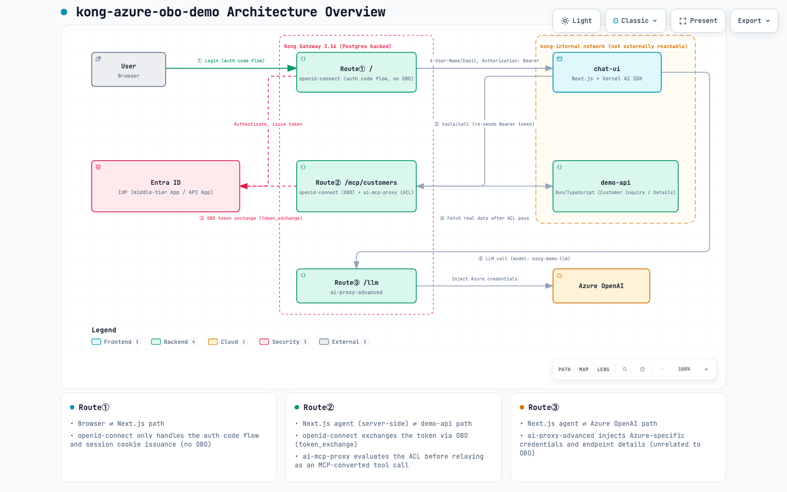
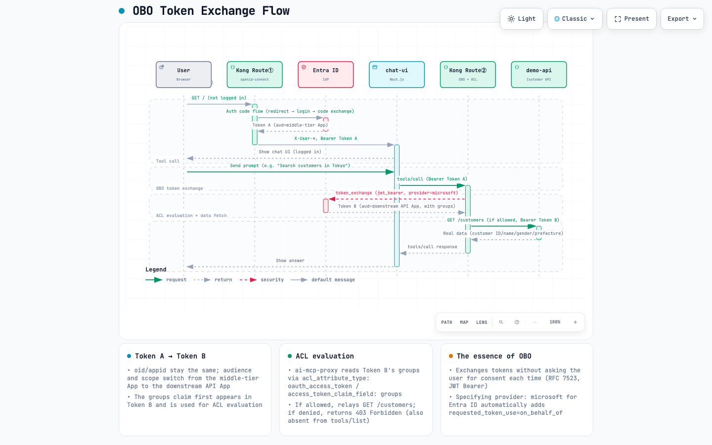

*Languages: English (this page) | [日本語](./OBO.md)*

# OBO (On-Behalf-Of) Explainer

This document summarizes the overall architecture of this demo and the details of the OBO (On-Behalf-Of) token exchange actually performed between Kong Gateway and Entra ID. See [design-brief.md](./design-brief.md) for the background of the design decisions, and [troubleshooting-log.md](./troubleshooting-log.md) for behavior discovered during implementation.

## 1. Overall Architecture

Kong Gateway fronts three distinct kinds of traffic through a single entry point (`http://localhost:8000`). The browser, Next.js, the demo API, and Azure OpenAI are all reachable only through Kong, and never communicate with each other directly (the `kong-internal` network, `internal: true`).

[](https://picketfence-labs.github.io/diagrams/e1e3f5245963/)

*Click the image to open the interactive version (pan/zoom, theme switch) (served via GitHub Pages at [picketfence-labs/diagrams](https://github.com/picketfence-labs/diagrams). Source: `docs/assets/obo-overview_en.architecture.json`, generated with [Archify](https://github.com/tt-a1i/archify)).*

- **Route① (`kong/login-route.yaml`)**: The browser ⇄ Next.js path. `openid-connect` only handles the authorization code flow and issues the session cookie. No OBO here.
- **Route② (`kong/mcp-route.yaml`)**: The Next.js agent (server-side) ⇄ demo API path. `openid-connect` exchanges the token via OBO (`token_exchange`), and `ai-mcp-proxy` evaluates the ACL before relaying the call as an MCP-converted tool call to the demo API.
- **Route③ (`kong/llm-route.yaml`)**: The Next.js agent ⇄ Azure OpenAI path. `ai-proxy-advanced` injects Azure-specific credentials and endpoint details (unrelated to OBO).

The core of this demo is that "the permission to log in as the agent" (Route①) and "the permission to execute an individual API" (Route②) are decided by separate Entra ID Security Groups (see [design-brief.md](./design-brief.md) section 2).

## 2. The OBO Flow

The essence of OBO is exchanging a "token addressed to the middle-tier App (the App Kong acts as an agent for)" into a "token addressed to the downstream API App", **without requiring the user's consent each time**. It uses RFC 7523 (JWT Bearer), and specifying `provider: microsoft` for Entra ID automatically adds `requested_token_use=on_behalf_of` (see [design-brief.md](./design-brief.md) section 3).

[](https://picketfence-labs.github.io/diagrams/e4640eb137c6/)

*Click the image to open the interactive version (pan/zoom, theme switch) (served via GitHub Pages at [picketfence-labs/diagrams](https://github.com/picketfence-labs/diagrams). Source: `docs/assets/obo-token-exchange-flow_en.sequence.json`, generated with [Archify](https://github.com/tt-a1i/archify)).*

### How the token contents change

Comparing the contents of the two tokens Kong mediates within the same user's login session shows what OBO actually changes. `sub`/`oid` (the claims identifying the user) stay the same, while **the audience and scope switch from the middle-tier App to the downstream API App, and the `groups` claim used for ACL evaluation appears for the first time**.

**Token A (issued by Entra ID at Route①, forwarded to Next.js as `Authorization: Bearer`)**
```json
{
  "aud": "11111111-1111-1111-1111-111111111111",
  "iss": "https://login.microsoftonline.com/<tenant-id>/v2.0",
  "sub": "AbCdEf... (a pairwise identifier unique to the user and app)",
  "oid": "99999999-9999-9999-9999-999999999999",
  "appid": "11111111-1111-1111-1111-111111111111",
  "scp": "access_as_user",
  "name": "Demo User - Both APIs",
  "preferred_username": "demo-both-apis@hashipicketfence.onmicrosoft.com"
  // Note: there is no groups claim, or only groups unrelated to this App:
  //   what's assigned here is the Security Group for "AI agent" login
  //   (used only for the Enterprise Application's "assignment required"
  //   setting to decide whether login is allowed; Kong never looks at this claim)
}
```

**Token B (obtained via `token_exchange` by openid-connect at Route②, forwarded on to demo-api)**
```json
{
  "aud": "22222222-2222-2222-2222-222222222222",
  "iss": "https://login.microsoftonline.com/<tenant-id>/v2.0",
  "sub": "GhIjKl... (same user, but a different value from Token A due to the different audience)",
  "oid": "99999999-9999-9999-9999-999999999999",
  "appid": "11111111-1111-1111-1111-111111111111",
  "scp": ".default",
  "groups": [
    "33333333-3333-3333-3333-333333333333",
    "44444444-4444-4444-4444-444444444444"
  ]
  // ↑ The Object IDs of the "API" Security Groups (for Customer Inquiry /
  //   Customer Details) assigned to the downstream API App appear here as-is.
  //   ai-mcp-proxy's acl_attribute_type: oauth_access_token /
  //   access_token_claim_field: groups reads this array and matches it
  //   against tools[].acl.allow to decide allow/deny.
}
```

Comparing the two:

| Claim | Token A (Route①) | Token B (Route②, after OBO exchange) |
|---|---|---|
| `aud` (audience) | middle-tier App | downstream API App |
| `scp` (scope) | `access_as_user` | `.default` (the downstream API's default scope) |
| `oid` (the user themselves) | same | same (unchanged) |
| `appid` (acting principal) | middle-tier App | middle-tier App (unchanged — shows Kong keeps acting as the agent) |
| `groups` | irrelevant to ACL evaluation | the Customer Inquiry/Details Security Group Object IDs appear, and become the input to the ACL decision |

The fact that `oid`/`appid` stay unchanged captures the very meaning of OBO: "the user themselves, acting through the middle-tier App (Kong) as their agent, is accessing the downstream API." Meanwhile, because `aud`/`scp`/`groups` do change, per-tool execution permission — which could not be decided at Route① — can finally be evaluated at Route②.

> [!note]
> The values above are illustrative samples, not real tenant IDs, client IDs, or user identifiers. For the actual steps to confirm ACL allow/deny behavior (with screenshots), see [TESTING.md](../TESTING.md).

## Related Documents
- [design-brief.md](./design-brief.md) — the source of truth for requirements and architecture
- [decisions/0002-mcp-llm-route-network-isolation.md](./decisions/0002-mcp-llm-route-network-isolation.md) — how Route②/③ are isolated from the browser, and the limits of that approach
- [troubleshooting-log.md](./troubleshooting-log.md) — details discovered during hands-on verification, such as `ai-mcp-proxy`'s self-request passing back through the same Kong router
- [TESTING.md](../TESTING.md) — steps to actually log in and confirm ACL allow/deny behavior
